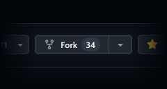
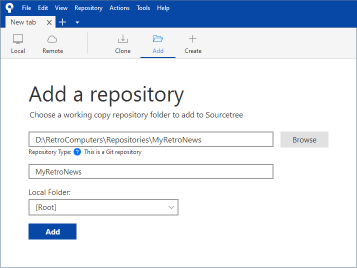

# RetroNews

**Retro computing news and guides archive**

------------------------------------------------------------------------------------------------------------------------


**Retro computer information has been disappearing from the internet at a worrying speed.** While _archive.org_ does an
excellent job most of the times, archived pages can sometimes fail to save correctly or become unusable later on. This
often happens due to the heavy use of _JavaScript_ on these sites or, in some cases, major hardware failures at
_archive.org_. **With this repository, we aim to manually preserve interesting news articles, guides, and resources for
retro computing enthusiasts, ensuring they remain accessible even when the original pages are lost.**

<small>**Note:** despite sharing similar goals to _The Retro Web_'s, and despite having a deliberately similar logo,
this project is in no way affiliated with them. </small>

------------------------------------------------------------------------------------------------------------------------

## Removal request

If you are the owner of one the archived documents and you want them removed from this repository — first of all, are
you sure you want us to forget old documents that are only significant to retro computer enthusiasts? If you are,
contact us via the [Issues](./Issues/) section and we will remove them promptly after proving your identity.

------------------------------------------------------------------------------------------------------------------------

## How to archive a news page or a guide?

<!--------------------------------------------------------------------------------------------------------------------->

### :mag: 1. Check for duplicates

First of all, perform a search for the page(s) that you want to archive in this _GitHub_ repository, as the page(s)
might have been archived already!

<!--------------------------------------------------------------------------------------------------------------------->

### :hammer: 2. Prepare your _Git_



Note: If you are not familiar with _Git_ you should consider getting _Atlassian SourceTree_, which is very easy to use
and does most things automatically, including installing _Git_ and _Git LFS_ (both required).

Start by forking this repository to your _GitHub_ account.

Now, clone your fork to your PC using the following commands, one row at a time:

```bash
cd "D:\RetroComputers\Repositories"
GIT_LFS_SKIP_SMUDGE=1 git clone https://github.com/YourGitHubAccount/RetroNews MyRetroNews
cd MyRetroNews
git config lfs.skipSmudge true
```



Unfortunately these extra manual steps are necessary at the moment because `SourceTree` has only minimal _Git LFS_
support. If a normal `clone` is performed, _Git_ will download every file including very large ones such as archives and
executables. However, if this is exactly what you are trying to accomplish, you may download the rest of the files, even
the very large ones by running the following command:

```bash
git lfs pull
```

And if you want to download only some of the very large files, you may specify their directory:

```bash
git lfs pull -I "archive/anandtech.com/2002-07-19-ATI-Radeon-9700-Pro-Delivering-as-promised/"
```

Finally if you want _Git_ to always download the large files without your explicit request, you may unset the
`skipSmudge` configuration via the terminal:

```bash
git config lfs.skipSmudge false
```

Now you should add the cloned repository to _SourceTree_ as shown in the image.

<!--------------------------------------------------------------------------------------------------------------------->

### :globe_with_meridians: 3. Determine the _eTLD+1[^1]_
Otherwise, identify the _eTLD+1_ of the page you want to archive. <!-- TBD IDNs -->

> Example: `https://www.anandtech.com/show/970` is `anandtech.com`.<br>
> Example: `https://forums.overclockers.co.uk/t/ati-radeon-x850-xt.../` is `overclockers.co.uk`.<br>

[^1]: _Effective Top Level Domains_ (_eTLDs_) are _TLDs_ like `.com`, `.net`, but also special _Second Level Domains_
such as `.co.uk`, `.co.jp` and `.com.au`. An _eTLD+1_ is the concatenation of an _eTLD_ and the part that is registrable
by a private entity — for example `overclockers.co.uk` or `anandtech.com`.

<!--------------------------------------------------------------------------------------------------------------------->

### :file_folder: 4. Locate the base folder for the _eTLD+1_

In your local clone, head to the folder for such a _eTLD+1_, or create it if it doesn't exist.

> Example: `./archive/anandtech.com/`

<!--------------------------------------------------------------------------------------------------------------------->

### :calendar: 5. Determine the date of the document

Determine the document's _ISO Date_ and note it down. If the date is not explicitly specified, try to guess it depending
on the content of the page. E.g. a review for a new graphics card will be published shortly after the release of the
card. However if you can't determine with absolute certainty the day, the month, or even the year, replace the
corresponding digits with lowercase `x`s.

> Example: `2002-07-19`, `2002-07-xx`, `2002-xx-xx`, `xxxx-xx-xx`

<!--------------------------------------------------------------------------------------------------------------------->

### :pencil2: 6. Create a _pathified_ version of the document's title

If the title is not in english, translate it appropriately using sensible capitalization; i.e. own-names with capital
first letter and acronyms in all-caps. This is highly subjective, so just try to make it look good. Use only _ASCII_
letters, numbers and _hyphens_ (`0x2D`). Drop any other character. Avoid contiguous, trailing and leading _hyphens_.

> Example: `ATI-Radeon-9700-Pro-Delivering-as-promised`<br>
> Wrong: `ATI-Radeon-9700-Pro--Delivering-as-promised`<br>
> Wrong: `ATI-Radeon-9700-Pro-Delivering-as-promised-`<br>
> Wrong: `-ATI-Radeon-9700-Pro-Delivering-as-promised`<br>
> Wrong: `ATI Radeon 9700 Pro - Delivering as promised`<br>

<!--------------------------------------------------------------------------------------------------------------------->

### :file_folder: 7. Create the base folder for the document

Create a folder whose name is the concatenation of the _ISO Date_, a _hyphen_, and the "_pathified_" title.

> Example: `./archive/anandtech.com/2002-07-19-ATI-Radeon-9700-Pro-Delivering-as-promised/`

<!--------------------------------------------------------------------------------------------------------------------->

### :pencil: 8. Create the file structure for the document

Open the directory that was just created and stub the following sub-folders and files: `attachments/`,
`screenshots/`, `readme.md`.

> Example: `./archive/anandtech.com/2002-07-19-ATI-`...`-promised/screenshots/`<br>
> Example: `./archive/anandtech.com/2002-07-19-ATI-`...`-promised/attachments/`<br>
> Example: `./archive/anandtech.com/2002-07-19-ATI-`...`-promised/readme.md`<br>

<!--------------------------------------------------------------------------------------------------------------------->

### :camera: 9. Archive the screenshots of the document

Create "_full-page screenshots_" using _Chrome Dev Tools_ (or equivalent) of the relevant page(s), and save them into
the `screenshots` folder as `1.png` if there is only one page, `2.png` for the second page, `3.png` for the third, etc.
Include such screenshots (or alternatively relevant source code fragments) even if the result is not "pretty", as these
files are not meant to be read directly but kept for historical and attribution reasons.

> Example: `./archive/anandtech.com/2002-07-19-ATI-`...`-promised/screenshots/1.png`<br>
> Example: `./archive/anandtech.com/2002-07-19-ATI-`...`-promised/screenshots/2.txt`<br>
> Example: `./archive/anandtech.com/2002-07-19-ATI-`...`-promised/screenshots/3.htm`<br>

### :books: 10. Archive the images and other small attachments

Download the images from the original site and save them to the `attachments` folder. To name such files, use the same
pattern previously used to _pathify_ the document title. Use names that make sense, and that are easily searchable.

> Example: `./archive/`...`/attachments/Radeon-9700-Pro-box.jpg`

Similarly, you may also include other attachments such as _PDF_ files.

> Example: `./archive/`...`/attachments/Samsung-K4D26323RA.pdf`

### 11. Archive binaries and other large files

Using the same pattern for filenames, you may also archive medium-sized files using _Git LFS_, which is enabled (as per
`.gitattributes`) for the following extensions: `exe`, `zip`, `rar`, `tar.gz`, `msi`.

<!--------------------------------------------------------------------------------------------------------------------->

### 10. Optionally convert the document to _Markdown_

Converting the page to _Markdown_ is optional but highly appreciated. Copy the following _Markdown_ structure to the
`readme.md` file and edit it as explained. Keep everything original; do not translate the text to english, do not remove
any typos, do not improve grammar or punctuation. If you feel an improved version of the text is absolutely required for
the document to be useful, you can create a _corrected copy_, which is explained later in this guide.

**This file (and all the other _Markdown_ derivatives) must have hard line wraps at 120 characters.**

```md
# Article or guide title using the original language and formatting

**Site:**     AnandTech                      <!-- Pretty version of the site's name.  -->
**URL:**      https://anandtech.com/show/970 <!-- Preferably a permalink, if any. -->
**Date:**     YYYY-MM-DD                     <!-- ISO Dates... no 'murican dates. -->
**Time:**     23:44 Europe/Rome              <!-- Time is rarely important but you can include it if necessary. -->
**Author:**   Anand Lal Shimpi               <!-- The author if known, otherwise omit this line. -->
**Keywords:** Review, Khan                   <!-- Extra keywords; words not already included in the page's body. -->

## First paragraph/page title.

First paragraph/page text.

## Second paragraph/page title.

Second paragraph/page text.
```

<!--------------------------------------------------------------------------------------------------------------------->

### 11. Improve the _Markdown_ version with embed images

You can improve the result by embedding in the document the images that were archived previously.

If needed, you may generate smaller clickable thumbnails in the main document, by keeping them in the `thumbnails`
folder. However, it is very unlikely that thumbnails will be necessary, as image resolution of old webpages is usually
very low already.

> Example: `./archive/`...`/attachments/thumbnails/Radeon-9700-Pro-box.png`<br>

Floating images **must** have a _width_ of `33%` and they can be attached to both the _left_ and _right_ margins.
Instead, block images must be centered and their width should be determined automatically by _GitHub_.

**Simple floating image:**

```html

```

**Zoomable floating image:**

```html
<a href="./attachments/Radeon-9700-Pro-box.jpg">
    
</a>
```

**Simple block image:**

```html
<div align="center">
    
</div>
```

**Zoomable block image:**

```html
<div align="center">
    <a href="./attachments/Radeon-9700-Pro-box.jpg">
        
    </a>
</div>
```

### 12. Improve the _Markdown_ version with bar graphs

You may use _HTML_ tables (or the _Markdown_ equivalent) to recreate the original bar-graphs on _GitHub_:

```md
<table align="center">
    <tr>
        <th colspan="4" align="center">Serious Sam 2<br>Little Trouble @ 1024x768</th>
    </tr>
    <tr>
        <th>Graphics Card</th>
        <th width="300">% Bar</th>
        <th>Avg. FPS</th>
        <th>% Delta</th>
    </tr>
    <tr>
        <td>Radeon 9700 Pro</td>
        <td></td>
        <td>130.3</td>
        <td>0%</td>
    </tr>
    <tr>
        <td>GeForce4 Ti 4600</td>
        <td></td>
        <td>112.2</td>
        <td>-13.89%</td>
    </tr>
</table>
```

Results in:

<blockquote>
    <table align="center">
        <tr>
            <th colspan="4" align="center">
                Serious Sam 2<br>
                Little Trouble @ 1024x768
            </th>
        </tr>
        <tr>
            <th>Graphics Card</th>
            <th width="300">% Bar</th>
            <th>Avg. FPS</th>
            <th>% Delta</th>
        </tr>
        <tr>
            <td>Radeon 9700 Pro</td>
            <td></td>
            <td>130.3</td>
            <td>0%</td>
        </tr>
        <tr>
            <td>GeForce4 Ti 4600</td>
            <td></td>
            <td>112.2</td>
            <td>-13.89%</td>
        </tr>
    </table>
</blockquote>

The appearance of the bar graphs doesn't have to be identical to the original, but can be adjusted to match _GitHub_'s
look and feel. Additionally, you may change or improve how the information is presented, as long the underlying data is
not altered.

Each bar must have a `width` between `0%` and `100%` and a height of `10`. The `alt` attribute must mirror the value of
`width`. There are 16 colors available for the bars, plus a gray one, all located in the `embeds` folder.

The bar column must be have a width between `200` and `300`, e.g. `<th width="300">% Graph</th>`.